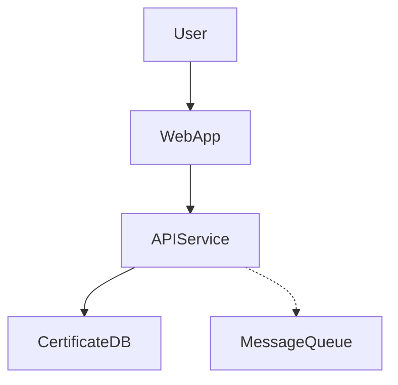
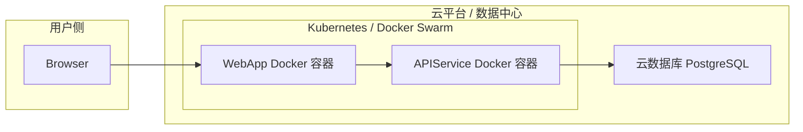

# AI Low-Code Platform POC

A simple web-based Proof of Concept for an AI-assisted low-code platform.

## Flow

1.  User submits requirements.
2.  PM reviews AI-generated PRD.
3.  Architect reviews AI-generated design documents.
4.  Developer reviews AI-generated code snippets.

Built with React and Ant Design. 

# 技术设计文档 - 高层设计

## 设计要点:
初步设计要点：
1. 系统需要具备高可用性。
2. 用户认证考虑OAuth 2.0。
3. 核心数据需要加密存储。

## 模块划分

# 高层设计 - 模块划分 (AI调整后)

根据您的指示，调整模块划分如下：
1.  **用户表示层 (User Interface Layer):** 处理用户交互，例如Web界面和移动App接口。
2.  **API网关层 (API Gateway Layer):** 新增，作为所有请求的统一入口，负责路由、认证、限流。
3.  **应用服务层 (Application Service Layer):** 编排核心业务逻辑，处理用例。
4.  **领域层 (Domain Layer):** 包含核心业务模型、实体、值对象和领域服务。
5.  **基础设施层 (Infrastructure Layer):** 提供通用技术能力，如数据库访问、消息传递、第三方服务集成等。
6.  **监控与日志模块 (Monitoring & Logging):** 新增，负责系统健康状况监控和日志收集。

---

## 应用/组件划分

# 高层设计 - 应用/组件划分

主要应用/组件包括：
-   **证书管理Web应用 (CertificateManagementWebApp):** 前端用户界面。
-   **证书管理API服务 (CertificateManagementAPIService):** 后端核心服务，提供RESTful API。
-   **数据库 (CertificateDB):** 存储所有证书及相关信息。
-   **(可选) 消息队列 (MessageQueue):** 用于异步任务处理，如通知。

---

## 应用/组件协作关系

# 高层设计 - 应用/组件协作关系

1.  用户通过 **WebApp** 与系统交互。
2.  **WebApp** 调用 **APIService** 完成业务操作。
3.  **APIService** 读写 **CertificateDB**。
4.  **APIService** (可选) 通过 **MessageQueue** 发送通知。

---

## 部署图

# 高层设计 - 部署图

初步设想部署方案：
-   **WebApp** 和 **APIService** 容器化部署 (例如 Docker)。
-   **CertificateDB** 可以使用云数据库服务。

---

