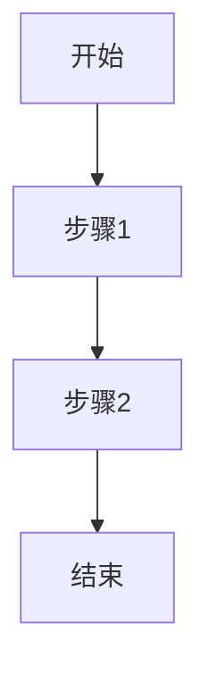

# 业务流程知识库

## 1. 核心业务流程目录
### 1.1 流程分类
- 主流程
- 子流程
- 异常流程
- 特殊场景流程

### 1.2 流程索引
| 流程ID | 流程名称 | 业务域 | 重要程度 | 更新时间 | 状态 |
|--------|----------|--------|-----------|----------|------|
| P001   |          |        |           |          |      |

## 2. 业务流程详情
### 流程名称
#### 基本信息
- **流程ID**: P001
- **业务域**: [所属业务域]
- **流程负责人**: [负责人]
- **最后更新时间**: YYYY-MM-DD
- **流程状态**: [活跃/废弃/待更新]

#### 流程说明
- **业务目标**:
- **触发条件**:
- **前置条件**:
- **后置条件**:
- **业务约束**:

#### 流程步骤

#### 步骤详情
1. **步骤1**
   - 输入:
   - 处理逻辑:
   - 输出:
   - 异常处理:
   - 业务规则:

2. **步骤2**
   [按上述格式继续描述]

#### 关联系统/服务
- 系统A：[调用说明]
- 系统B：[调用说明]

#### 异常场景处理
| 异常场景 | 处理方式 | 是否中断流程 | 补偿措施 |
|----------|----------|--------------|----------|
|          |          |              |          |

#### 性能要求
- 流程总体SLA:
- 关键步骤SLA:
- 并发要求:

#### 扩展点
- 扩展点1：[说明]
- 扩展点2：[说明]

## 3. 业务流程最佳实践
### 3.1 常见问题
1. 问题1
   - 现象：
   - 原因：
   - 解决方案：

### 3.2 优化建议
1. 建议1
   - 现状：
   - 优化方向：
   - 预期效果：

### 3.3 案例分享
1. 案例1
   - 场景：
   - 解决方案：
   - 效果：
   - 经验总结： 