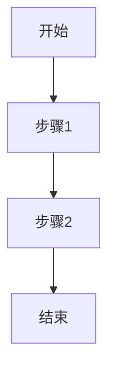

# 业务需求文档模板 (BRD)

## 1. 业务背景
- **项目概述**：[描述项目的整体目标和业务价值]
- **业务痛点**：[列出当前业务中存在的问题和挑战]
- **目标用户**：[描述目标用户群体及其特征]

## 2. 功能需求
### 2.1 核心功能
- **功能点1**：
  - 详细描述：
  - 输入：
  - 输出：
  - 业务规则：
  - 异常处理：

- **功能点2**：
  [按上述格式继续描述]

### 2.2 非功能需求
- **性能要求**：
  - 响应时间：
  - 并发量：
  - 数据量：

- **安全要求**：
  - 权限控制：
  - 数据安全：
  - 审计日志：

## 3. 业务流程
### 3.1 主流程

### 3.2 异常流程
- **异常场景1**：
  - 触发条件：
  - 处理方式：
  - 恢复策略：

## 4. 数据定义
### 4.1 业务实体
- **实体1**：
  - 属性1：[类型，描述，约束]
  - 属性2：[类型，描述，约束]

### 4.2 业务规则
1. 规则1：[详细描述]
2. 规则2：[详细描述]

## 5. 接口需求
### 5.1 外部接口
- **接口1**：
  - 用途：
  - 调用方式：
  - 请求参数：
  - 响应数据：
  - 异常处理：

## 6. UI/UX需求
### 6.1 页面布局
- **页面1**：
  - 布局要求：
  - 交互要求：
  - 展示规则：

### 6.2 操作流程
1. 步骤1：[详细描述]
2. 步骤2：[详细描述]

## 7. 验收标准
### 7.1 功能验收
- **测试场景1**：
  - 前置条件：
  - 测试步骤：
  - 预期结果：

### 7.2 性能验收
- **指标1**：[具体要求]
- **指标2**：[具体要求] 