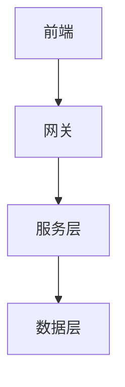

# 技术设计文档模板 (TDD)

## 1. 系统架构
### 1.1 整体架构


### 1.2 技术栈选型
- **前端**：[框架、库、工具]
- **后端**：[框架、中间件、数据库]
- **部署**：[容器化、CI/CD]

## 2. 详细设计
### 2.1 数据模型
```sql
-- 示例表结构
CREATE TABLE example (
    id BIGINT PRIMARY KEY,
    name VARCHAR(100),
    created_at TIMESTAMP
);
```

### 2.2 接口设计
#### API 1：[接口名称]
```yaml
路径: /api/v1/example
方法: POST
请求体:
  {
    "field1": "string",
    "field2": "number"
  }
响应体:
  {
    "code": 200,
    "data": {}
  }
```

### 2.3 核心算法
```typescript
// 核心算法伪代码
function processBusinessLogic(input: Input): Output {
    // 1. 输入验证
    // 2. 业务处理
    // 3. 结果返回
}
```

## 3. 代码结构
```
src/
├── components/    # 组件目录
├── services/     # 服务层
├── utils/        # 工具函数
└── types/        # 类型定义
```

## 4. 性能设计
### 4.1 缓存策略
- **缓存级别**：[浏览器缓存/应用缓存/数据库缓存]
- **缓存内容**：[缓存对象描述]
- **更新策略**：[更新机制]

### 4.2 性能优化
- **前端优化**：[加载优化/渲染优化]
- **后端优化**：[数据库优化/服务优化]
- **网络优化**：[压缩/CDN]

## 5. 安全设计
### 5.1 认证授权
- **认证方式**：[JWT/Session]
- **权限模型**：[RBAC/ACL]
- **安全措施**：[XSS/CSRF防护]

### 5.2 数据安全
- **传输加密**：[HTTPS/数据加密]
- **存储加密**：[敏感数据加密]
- **审计日志**：[操作记录]

## 6. 测试策略
### 6.1 单元测试
```typescript
// 测试用例示例
describe('BusinessService', () => {
    it('should process data correctly', () => {
        // 测试逻辑
    });
});
```

### 6.2 集成测试
- **测试范围**：[测试点列表]
- **测试数据**：[数据准备]
- **测试用例**：[用例描述]

## 7. 部署方案
### 7.1 环境配置
```yaml
# 环境变量配置
DATABASE_URL: xxx
REDIS_HOST: xxx
API_KEY: xxx
```

### 7.2 部署流程
1. 代码构建
2. 单元测试
3. 打包部署
4. 健康检查

## 8. 监控告警
### 8.1 监控指标
- **业务指标**：[核心业务指标]
- **系统指标**：[CPU/内存/磁盘]
- **服务指标**：[QPS/响应时间]

### 8.2 告警规则
- **告警级别**：[P0/P1/P2]
- **告警阈值**：[具体阈值]
- **处理流程**：[处理步骤] 